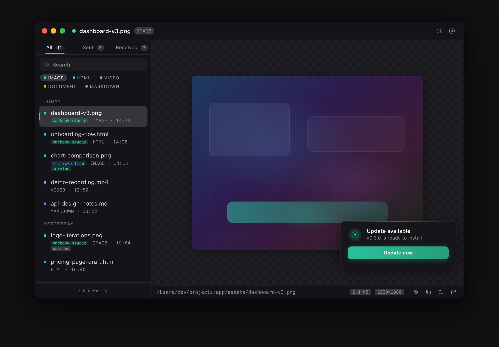
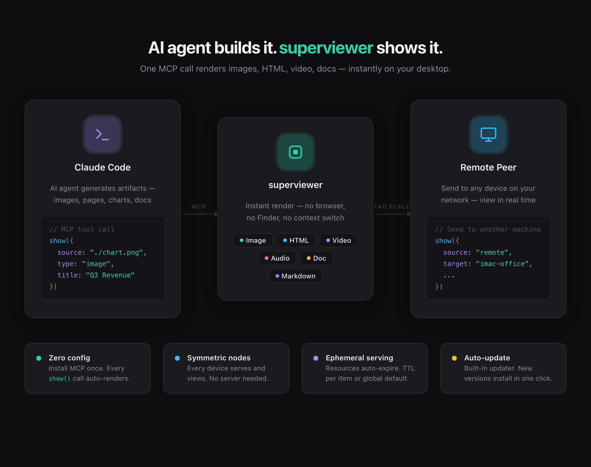

<p align="center">
  
</p>

<h1 align="center">superviewer</h1>

<p align="center">
  <strong>AI agent builds it. superviewer shows it.</strong><br>
  <sub>Instant desktop viewer for AI-generated artifacts (images, HTML, video, docs) via MCP.</sub>
</p>

<p align="center">
  <a href="https://github.com/dodlabinc/superviewer-releases/releases/latest">
    
  </a>
  
  
</p>

<br>

<p align="center">
  
</p>

---

## What is superviewer?

When AI agents (like Claude Code) generate files, you normally have to dig through Finder, open a browser, or switch between apps just to see the result. **superviewer** skips all of that.

One MCP tool call → content renders instantly in a persistent desktop viewer.

<p align="center">
  
</p>

## Features

- **Instant render.** Supports image, HTML, video, audio, markdown, and documents. No browser needed.
- **MCP integration.** One `show()` call from Claude Code. Nothing to configure after install.
- **Symmetric nodes.** Every device both serves and views. No central server.
- **Remote peers.** Send artifacts to any machine on your network via Tailscale or LAN.
- **Ephemeral serving.** Resources auto-expire with configurable TTL.
- **Feed history.** Searchable, filterable timeline of everything you've viewed.
- **Auto-update.** Built-in updater with one-click install.

## Quick Start

### 1. Install

Download the latest `.dmg` from [Releases](https://github.com/dodlabinc/superviewer-releases/releases/latest).

### 2. Enable MCP

Open superviewer → Settings → MCP section → **Install**.

This registers superviewer as an MCP server in `~/.claude/settings.json`.

### 3. Use from Claude Code

```
show("./chart.png", "image")
show("./report.html", "html", { title: "Q3 Report" })
```

Content appears instantly in superviewer.

## MCP Tools

| Tool | Description |
|---|---|
| `show(source, type, meta?)` | Render a single file |
| `show_group(items, meta?)` | Render multiple files as a group |
| `capture(window?, meta?)` | Capture a screen/window and display |

## Remote Peers

Send artifacts to another machine running superviewer:

```
show("./design.png", "image", { target: "imac-office" })
```

Manage peers in Settings → Peers. Devices discover each other via Tailscale IP or LAN.

## Tech Stack

| Layer | Technology |
|---|---|
| Framework | Tauri v2 (Rust + WebView) |
| Frontend | React + TypeScript + Tailwind CSS |
| Connectivity | `std::net` over Tailscale/LAN |
| Serving | Rust HTTP (token auth + range requests) |
| Update | Tauri updater plugin (GitHub Releases) |

## Development

```bash
# Install dependencies
pnpm install

# Development (run in separate terminals)
pnpm tauri dev

# Build for production
pnpm tauri build
```

## License

Proprietary. Dodlab, Inc.
