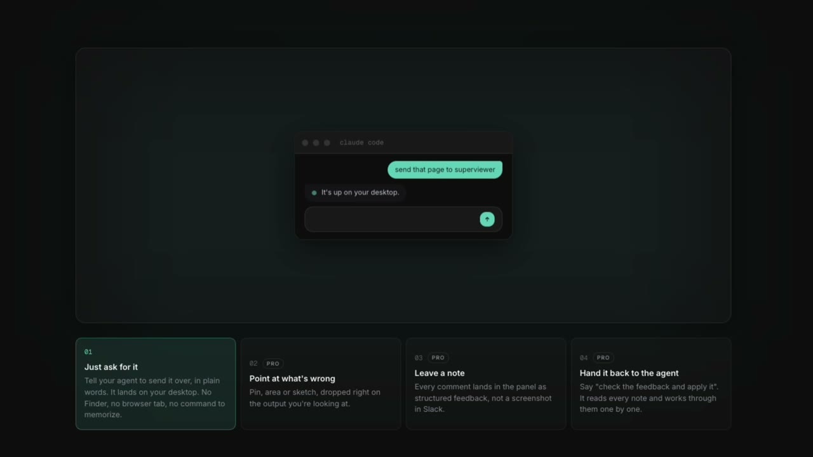
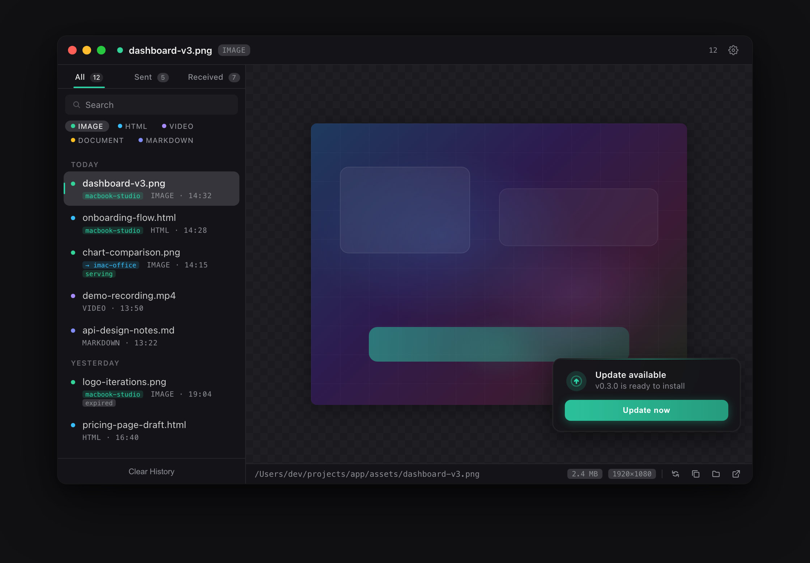
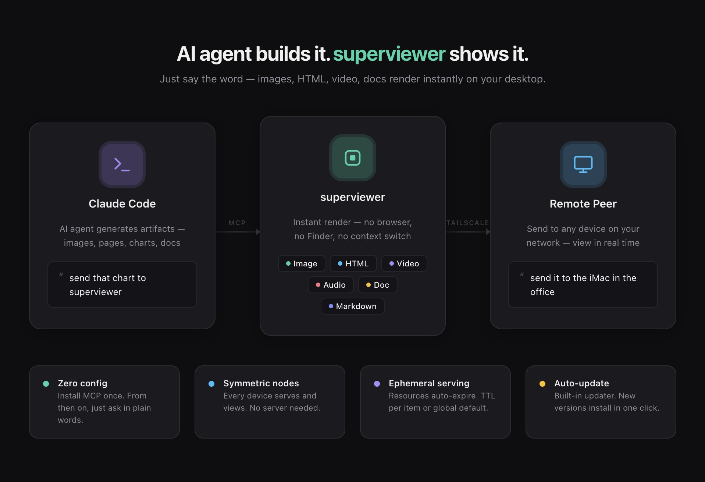
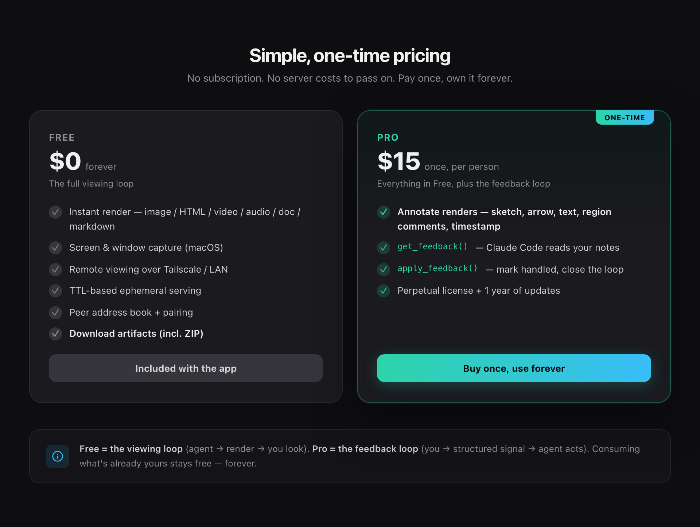

  

<h1 align="center">superviewer</h1>

  <strong>AI agent builds it. superviewer shows it.</strong> 
  Instant desktop viewer for AI-generated artifacts (images, HTML, video, docs) via MCP.

  
  
  

 

  
   
  ▶ <a href="https://raw.githubusercontent.com/dodlabinc/superviewer-releases/main/marketing/demo.mp4">Watch the demo video</a>

  

---

## What is superviewer?

When AI agents (like Claude Code) generate files, you normally have to dig through Finder, open a browser, or switch between apps just to see the result. **superviewer** skips all of that.

One MCP tool call, and the content renders instantly in a persistent desktop viewer.

  

## Features

- **Instant render.** Supports image, HTML, video, audio, markdown, and documents. No browser needed.
- **MCP integration.** One `show()` call from Claude Code. Nothing to configure after install.
- **Drag & drop.** Drop files onto the window or open them from Finder with "Open With."
- **Split view.** Compare up to 4 files side by side.
- **Symmetric nodes.** Every device both serves and views. No central server.
- **Remote peers.** Send artifacts to any machine on your network via Tailscale or LAN.
- **Ephemeral serving.** Resources auto-expire with configurable TTL.
- **Feed history.** Searchable, filterable timeline of everything you've viewed, with Received/Sent tabs.
- **Markdown viewer.** In-app links, outline, tables, and Mermaid diagram rendering.
- **Browser-like navigation.** Back/forward through viewed links and files.
- **Live editing indicators.** See when a file you're viewing is still being updated by the agent.
- **Auto-update.** Built-in updater with one-click install.

## Pricing

  

**Free** covers the full viewing loop — instant render, screen/window capture, split view (up to 4 files side by side), remote viewing over Tailscale/LAN, ephemeral serving, searchable feed history and auto-update. Forever, no subscription.

**Pro ($19, one-time)** adds the feedback loop: annotate renders (pin, region, arrow, draw, text, timestamp), your agent reads and fixes every note one by one, notes get marked done as they're handled, feedback syncs in from your other machines, plus artifact downloads (incl. ZIP) and a perpetual license with 1 year of updates.

## Download

**[Download latest release](https://github.com/dodlabinc/superviewer-releases/releases/latest)**

| Platform | File | Architecture |
|----------|------|--------------|
| macOS | `.dmg` | Apple Silicon |

## Quick Start

### 1. Install

Download the `.dmg`, drag to Applications, and open.

### 2. Enable MCP

Open superviewer > Settings > MCP section > **Install**.

This registers superviewer as an MCP server in `~/.claude/settings.json`.

### 3. Use

Ask Claude Code to generate or show any file. Images, HTML, charts, videos. superviewer picks it up automatically via MCP. No extra commands needed.

You can also drag files directly onto the superviewer window, or right-click a file in Finder and choose "Open With" > superviewer.

## Remote Peers

Send artifacts to another machine running superviewer over Tailscale or LAN. Manage peers in Settings > Peers.

## Auto-Update

superviewer checks for updates automatically every hour. When a new version is available, you'll see a notification in the app. You can also check manually from the app menu > **Check for Updates**, or from Settings.

---

Made by [Dodraft](https://dodraft.studio)
